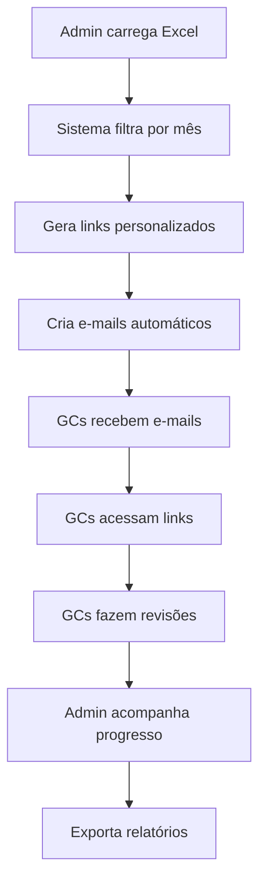

# 📊 Dashboard Revisão Carteira

> Sistema inteligente para controle e gestão da revisão de carteira de pedidos comerciais

[](https://www.python.org/downloads/)
[](https://streamlit.io/)
[]()
[]()

## 🎯 **Visão Geral**

O Dashboard Revisão Carteira é uma solução completa para automatizar e acompanhar o processo de revisão de carteiras de pedidos comerciais. O sistema oferece uma interface intuitiva para administradores gerenciarem o processo e links personalizados para que Gerentes Comerciais (GCs) façam suas revisões de forma eficiente.

### ✨ **Principais Características**

- 🔄 **Automação completa** do processo de revisão
- 📧 **Geração automática de e-mails** personalizados
- 🔗 **Links únicos e seguros** para cada GC
- 📈 **Métricas em tempo real** de progresso
- 🎨 **Interface moderna** e responsiva
- 💾 **Persistência de dados** entre sessões
- 📊 **Análises visuais** interativas

## 🚀 **Funcionalidades**

### 📋 **Para Administradores**
- **Upload de carteira**: Importação de arquivos Excel da carteira
- **Filtro automático**: Por mês de trabalho usando a coluna `Revisão Data Faturamento`
- **Dashboard completo**: Métricas, gráficos e análises em tempo real
- **Geração de links**: Links personalizados para cada GC
- **E-mails automáticos**: Criação e envio via Outlook
- **Controle de progresso**: Acompanhamento individual por GC

### 👤 **Para Gerentes Comerciais**
- **Acesso direto**: Via link personalizado e seguro
- **Interface simplificada**: Foco apenas na revisão
- **Duas ações simples**: ✅ Confirmar ou 📅 Alterar data
- **Resumo personalizado**: Por grupo de produtos
- **Progresso individual**: Acompanhamento de revisões realizadas

### 📊 **Análises Disponíveis**
- **Por Status de Crédito**: Liberados, Não liberado, Bloqueados
- **Por Diretoria**: Distribuição de valor e volume
- **Por Grupo de Produto**: Segmentação detalhada
- **Progresso de Revisão**: % de conclusão por GC
- **Métricas Financeiras**: Valores em milhões (sem centavos)

## 🛠️ **Tecnologias Utilizadas**

- **[Python 3.8+](https://python.org/)** - Linguagem principal
- **[Streamlit](https://streamlit.io/)** - Framework web interativo
- **[Pandas](https://pandas.pydata.org/)** - Manipulação de dados
- **[Plotly](https://plotly.com/)** - Visualizações interativas
- **[openpyxl](https://openpyxl.readthedocs.io/)** - Leitura de arquivos Excel

## 📦 **Instalação**

### Pré-requisitos
- Python 3.8 ou superior
- Microsoft Outlook (para geração de e-mails)
- Git (para versionamento) - [Download aqui](https://git-scm.com/download/win)

### 1. Clone ou baixe o projeto
```bash
# Se você tem acesso ao repositório
git clone https://github.com/seu-usuario/dashboard-revisao-carteira.git
cd dashboard-revisao-carteira

# Ou baixe e extraia o arquivo ZIP
```

### 2. Crie um ambiente virtual
```bash
python -m venv venv
```

### 3. Ative o ambiente virtual
```bash
# Windows
venv\Scripts\activate

# Linux/Mac
source venv/bin/activate
```

### 4. Instale as dependências
```bash
pip install -r requirements.txt
```

## 🚀 **Como Usar**

### 1. Inicie a aplicação
```bash
streamlit run app.py
```

### 2. Acesse o dashboard
Abra seu navegador em: `http://localhost:8501`

### 3. Para Administradores

1. **📁 Upload**: Carregue o arquivo Excel da carteira na sidebar
2. **🗓️ Período**: Selecione o mês/ano de trabalho
3. **📊 Análise**: Visualize métricas e aplique filtros
4. **🔗 Links**: Gere links personalizados para cada GC
5. **📧 E-mails**: Crie e envie e-mails automáticos

### 4. Para Gerentes Comerciais

1. **🔗 Acesso**: Clique no link recebido por e-mail
2. **👀 Revisão**: Visualize sua carteira filtrada
3. **✅ Ação**: Confirme ou altere datas conforme necessário
4. **💾 Salvamento**: Alterações são salvas automaticamente

## 📋 **Estrutura do Arquivo Excel**

O arquivo Excel deve conter as seguintes colunas:

| Coluna | Descrição | Obrigatório |
|--------|-----------|-------------|
| `Revisão Data Faturamento` | Data de faturamento para filtro | ✅ |
| `Ord.venda` | Número da ordem de venda | ✅ |
| `GC` | Nome do Gerente Comercial | ✅ |
| `Vl.Saldo` | Valor do saldo | ✅ |
| `Saldo` | Volume/quantidade | ✅ |
| `Nome Emissor` | Nome do cliente | ✅ |
| `Desc. Material` | Descrição do produto | ✅ |
| `Grupo` | Grupo de produto | ✅ |
| `DIRETORIA` | Diretoria responsável | ✅ |
| `Status crédito` | Status do crédito | ✅ |

## ⚙️ **Configurações**

### URL Base
Para deployment em produção, altere a `base_url` na função `generate_personalized_links()`:

```python
base_url = "https://sua-aplicacao.streamlit.app"  # Substitua pela URL real
```

### Lógica de Mês de Trabalho
O sistema segue a regra:
- **Julho** → trabalha **Agosto**
- **Agosto** → trabalha **Setembro**
- **Dezembro** → trabalha **Janeiro** (próximo ano)

## 🔒 **Segurança**

- **Links únicos**: Hash MD5 baseado em GC + mês + ano
- **Validação temporal**: Links válidos apenas para o período específico
- **Controle de acesso**: Verificação de hash antes de exibir dados
- **Session State**: Dados isolados por sessão

## 📊 **Métricas Monitoradas**

### Principais KPIs
- **Total de Registros**: Quantidade de pedidos na carteira
- **Valor Total**: Soma em milhões de reais (sem centavos)
- **Volume Total**: Quantidade total de produtos
- **% Revisão**: Percentual de pedidos revisados
- **% Alterações**: Percentual de datas alteradas

### Segmentações
- **Por Status de Crédito**: Distribuição dos pedidos
- **Por Diretoria**: Análise por área de negócio
- **Por GC**: Performance individual de revisão
- **Por Grupo**: Categorização de produtos

## 🔄 **Fluxo de Trabalho**



## 📁 **Estrutura do Projeto**

```
dashboard-revisao-carteira/
├── app.py                 # Aplicação principal
├── requirements.txt       # Dependências
├── README.md             # Documentação
└── dados/               # Pasta para arquivos de dados
    └── carteira_exemplo.xlsx
```

## ⚙️ **Deployment e Configuração**

### Para uso em produção (Streamlit Cloud)
1. Faça upload dos arquivos para um repositório privado
2. Configure o Streamlit Cloud apontando para o repositório
3. Altere a `base_url` no código para a URL de produção

### Configurações importantes
- **URL Base**: Ajustar para produção na função `generate_personalized_links()`
- **Segurança**: Sistema usa hash MD5 para links únicos
- **Dados**: Session state mantém dados durante a sessão

## � **Contato e Suporte**

Este é um projeto desenvolvido especificamente para as necessidades da empresa.

**Para suporte técnico ou dúvidas:**
- 📧 E-mail: seu.email@empresa.com
- 💬 Teams: @seu.usuario
- 📱 WhatsApp: (xx) xxxxx-xxxx

## 📝 **Notas de Versão**

### v1.0.0 (Atual)
- ✅ Sistema completo de revisão de carteira
- ✅ Links personalizados para GCs
- ✅ Geração automática de e-mails
- ✅ Dashboard com métricas em tempo real
- ✅ Filtros por período usando "Revisão Data Faturamento"
- ✅ Valores sem centavos para melhor visualização

### Próximas melhorias
- 🔄 Integração com banco de dados
- 📊 Relatórios automáticos em PDF
- 🔔 Notificações por WhatsApp
- 📱 Versão mobile otimizada

---

💼 **Desenvolvido exclusivamente para uso interno da empresa** 💼
